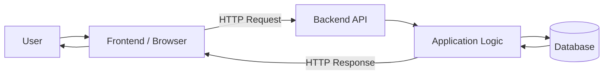

# Web Architecture Notes

## Basic Web Application Flow

A user interacts with the frontend through a client such as a web browser.

The frontend sends an HTTP request to a backend API.

The backend receives the request, processes application logic and may request data from a database.

The database returns the requested data to the backend.

The backend creates an HTTP response and sends it back to the frontend through the API.

The frontend receives the response and displays the result to the user.

## Basic Flow

User
→ Client / Browser
→ Frontend
→ HTTP Request
→ Backend API
→ Backend
→ Database
→ Backend
→ HTTP Response
→ Frontend
→ User

## Key Concepts

- Client: software that sends requests to a server, for example a web browser.
- Server: a system that receives requests and provides responses.
- Frontend: the user-facing part of a web application.
- Backend: the server-side part that processes requests and application logic.
- Database: stores and provides application data.
- API: defines how software components communicate with each other.
- HTTP: a protocol used for communication between clients and servers.
- HTTP Method: describes the action requested, for example GET.
- API Endpoint: a specific address exposed by an API, for example /api/flights.
- HTTP Status Code: describes the result of an HTTP request, for example 200 OK.

## Architecture Diagram

## Network Debugging Basics

Browser DevTools Network tab can be used to inspect HTTP requests and responses.

### Request Inspection

For each request, useful information includes:

- Request URL: the address of the requested resource or API endpoint.
- Request Method: the HTTP method used, for example GET, POST or PUT.
- Status Code: the result of the HTTP request, for example 200 OK, 404 Not Found or 500 Internal Server Error.
- Payload: the data sent from the frontend to the server.
- Response: the data returned by the server.
- Timing: shows how long different stages of the request took.

### Basic Debugging Observations

- A DNS error can occur before an HTTP request reaches a server, so there may be no HTTP status code.
- A 404 response means the server was reached, but the requested resource was not found.
- A 500 response means the server encountered an error while processing the request.
- Long "Waiting for server response" time can indicate delays related to the network, backend processing, databases or external services.
- Long "Content Download" time can indicate a large response or slow data transfer.
- Network throttling can be used to test application behavior on slow connections.
- Multiple requests completing in a different order can cause race conditions if outdated responses overwrite newer UI state.

### QA Debugging Approach

When investigating a problem:

1. Reproduce the issue.
2. Find the relevant request in the Network tab.
3. Check the request method, endpoint and status code.
4. Inspect the request payload or parameters.
5. Inspect the response body.
6. Check request timing.
7. Compare the network behavior with the expected UI behavior.
8. Record observed facts separately from assumptions about the root cause.